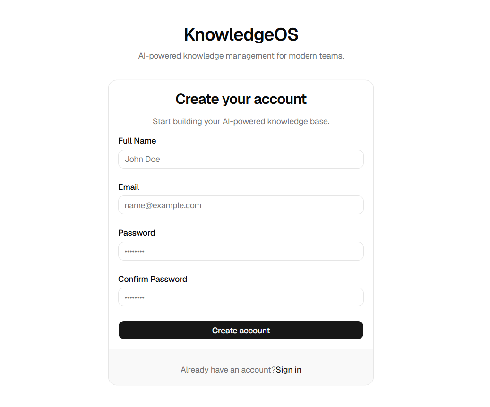
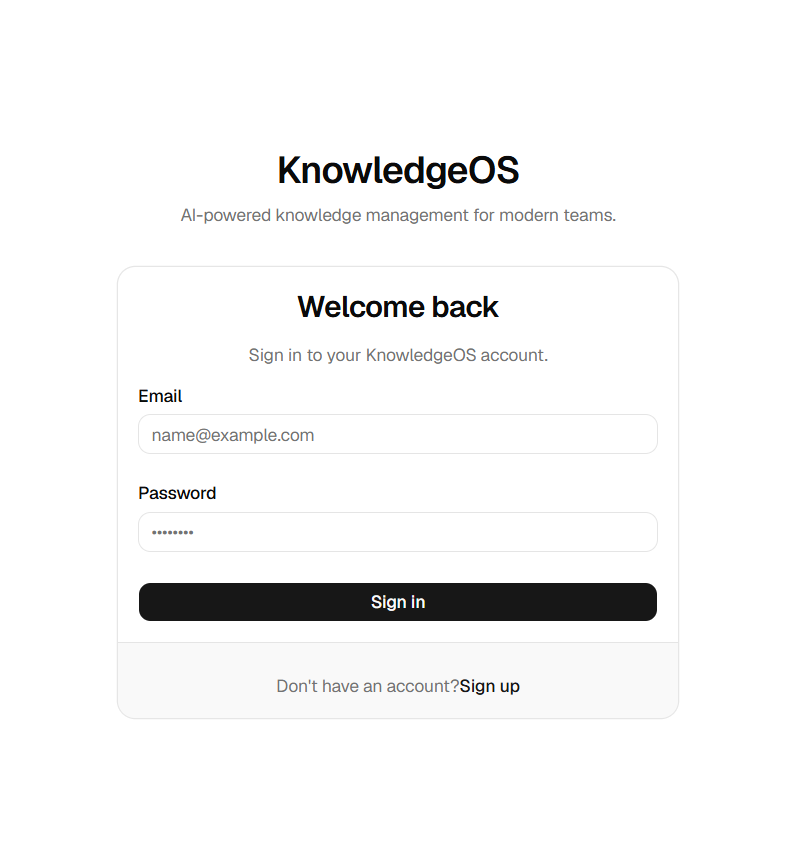
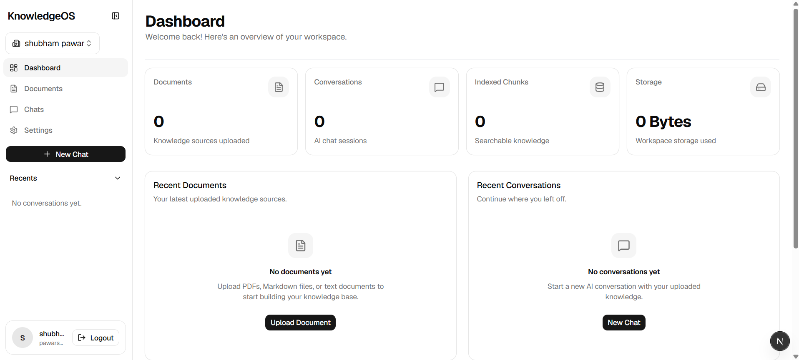
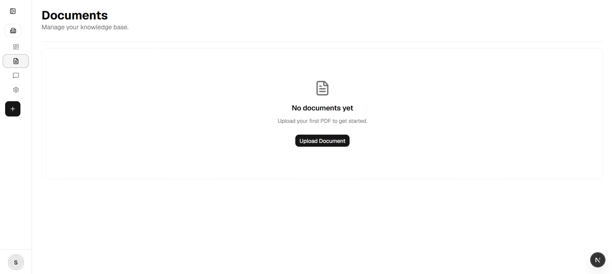
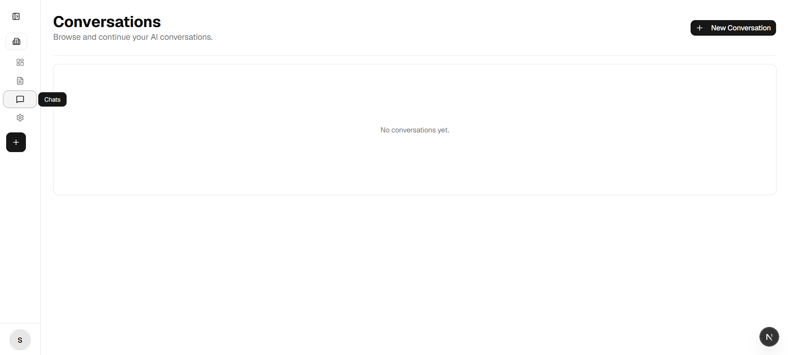
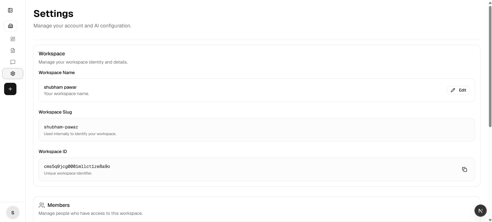
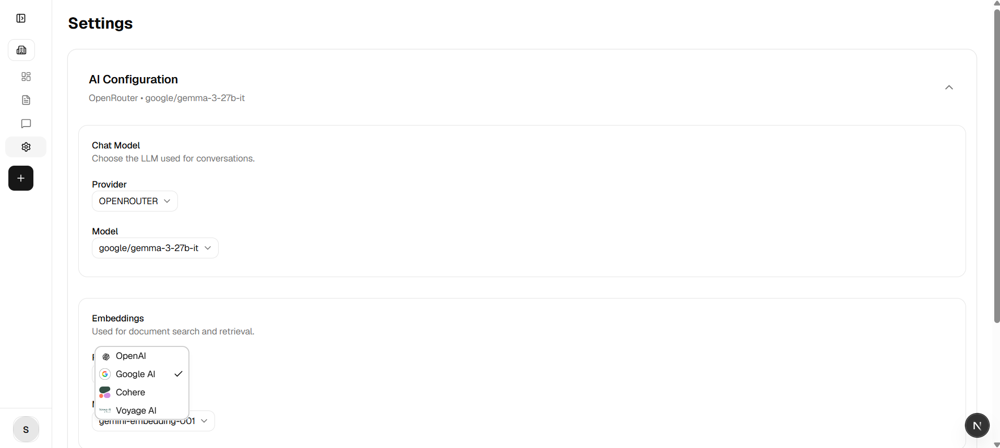
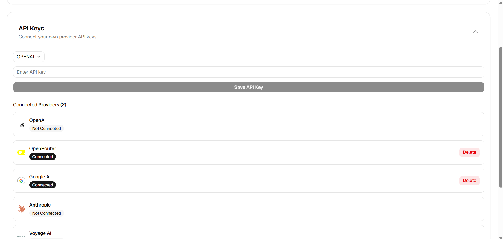
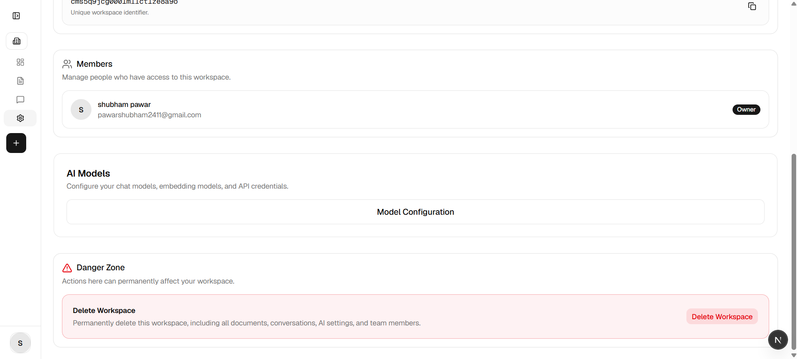
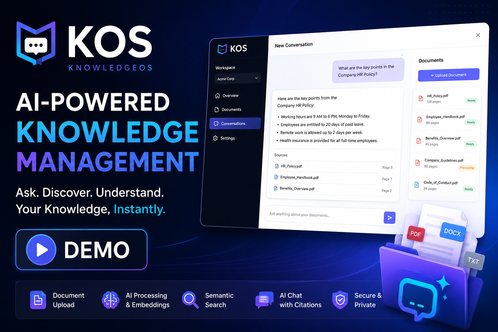

# KnowledgeOS

> **An AI-powered workspace to organize, search, and chat with your knowledge.**

KnowledgeOS is a modern RAG (Retrieval-Augmented Generation) application that allows users to upload documents, generate vector embeddings, and chat with their own knowledge using their preferred AI provider.

---

## ✨ Features

### 🧠 AI Chat

* Chat with your uploaded documents
* Streaming AI responses
* Markdown rendering
* Syntax-highlighted code blocks
* Copy code with one click
* Conversation history
* Rename conversations
* Soft delete conversations

### 📄 Document Management

* PDF document upload
* Background document processing
* Text extraction
* Intelligent chunking
* Vector embeddings
* Semantic search ready
* Document status tracking

### 👥 Workspace Management

* Multi-workspace support
* Workspace switching
* Workspace members
* Workspace dashboard

### 🤖 AI Configuration

* User configurable AI providers
* Configurable chat models
* Configurable embedding models
* Provider API key management

### 📊 Dashboard

* Document statistics
* Storage usage
* Indexed chunks
* Recent conversations
* Recent documents

### 🔐 Authentication

* Secure authentication
* Session management
* Protected routes
* User profiles

---

# Tech Stack

| Category         | Technology       |
| ---------------- | ---------------- |
| Framework        | Next.js 16       |
| Language         | TypeScript       |
| Styling          | Tailwind CSS     |
| UI               | shadcn/ui        |
| ORM              | Prisma           |
| Database         | PostgreSQL       |
| Vector Database  | pgvector         |
| Storage          | Supabase Storage |
| Authentication   | Better Auth      |
| AI SDK           | Vercel AI SDK    |
| Background Jobs  | Inngest          |
| State Management | TanStack Query   |
| Validation       | Zod              |

---

# Architecture

```
                Upload Document
                       │
                       ▼
             Supabase Storage
                       │
                       ▼
            Background Processing
                       │
      ┌────────────────────────┐
      │ Extract Text           │
      │ Clean Text             │
      │ Chunk Text             │
      │ Generate Embeddings    │
      └────────────────────────┘
                       │
                       ▼
               PostgreSQL + pgvector
                       │
                       ▼
                 Semantic Search
                       │
                       ▼
                 AI Response (RAG)
```

---

# Project Structure

```
src
├── app
├── components
├── features
│   ├── auth
│   ├── chat
│   ├── dashboard
│   ├── documents
│   ├── settings
│   └── workspaces
├── server
│   ├── ai
│   ├── processing
│   ├── inngest
│   ├── db
│   └── api
├── lib
├── hooks
└── types
```

---

# Getting Started

## Clone Repository

```bash
git clone https://github.com/yourusername/knowledge-os.git

cd knowledge-os
```

---

## Install Dependencies

```bash
pnpm install
```

or

```bash
npm install
```

---

## Configure Environment

Create a `.env` file.

```env
DATABASE_URL=

BETTER_AUTH_SECRET=
BETTER_AUTH_URL=

SUPABASE_URL=
SUPABASE_SERVICE_ROLE_KEY=
SUPABASE_BUCKET=

OPENAI_API_KEY=
GOOGLE_API_KEY=
ANTHROPIC_API_KEY=

INNGEST_EVENT_KEY=
INNGEST_SIGNING_KEY=
```

---

## Database

```bash
pnpm prisma generate

pnpm prisma migrate deploy
```

---

## Start Development

```bash
pnpm dev
```

---

# How It Works

### 1. Upload

Upload a PDF into your workspace.

↓

### 2. Processing

The document is processed asynchronously.

* Extract text
* Clean text
* Split into chunks
* Generate embeddings

↓

### 3. Storage

Embeddings are stored inside PostgreSQL using **pgvector**.

↓

### 4. Chat

Ask questions.

KnowledgeOS retrieves the most relevant chunks and provides grounded AI responses.

---

# Current Features

* Authentication
* Multi Workspace
* Dashboard
* PDF Upload
* Background Processing
* Vector Embeddings
* RAG Pipeline
* AI Chat
* Markdown Rendering
* Conversation History
* Rename Conversations
* Delete Conversations
* AI Model Configuration
* Storage Statistics

---

# Roadmap

## Version 2

* Streaming citations
* Advanced semantic search
* Hybrid search
* Multiple document formats
* Image OCR
* Conversation search
* Collections
* Shared workspaces
* Team collaboration
* Prompt library

---

## Version 3

* AI Agents
* Web Search
* Deep Research
* Voice Chat
* Browser Extension
* Chrome Side Panel
* Mobile App

---

## 📸 Screenshots

### SignUp Page



### SignIn Page



### Dashboard



### Document



### AI Chat



### Settings






---

## 🎥 Demo

[](https://www.youtube.com/watch?v=Kz4e6XVQahU)

---

# Contributing

Contributions, feature requests, and bug reports are welcome.

Feel free to open an issue or submit a pull request.

---

# License

MIT License

---

## Built With ❤️

* Next.js
* TypeScript
* Prisma
* PostgreSQL
* Supabase
* Better Auth
* Vercel AI SDK
* Tailwind CSS
* shadcn/ui

---

> **KnowledgeOS helps you build a searchable, AI-powered knowledge base from your documents—so your information is always available when you need it.**
